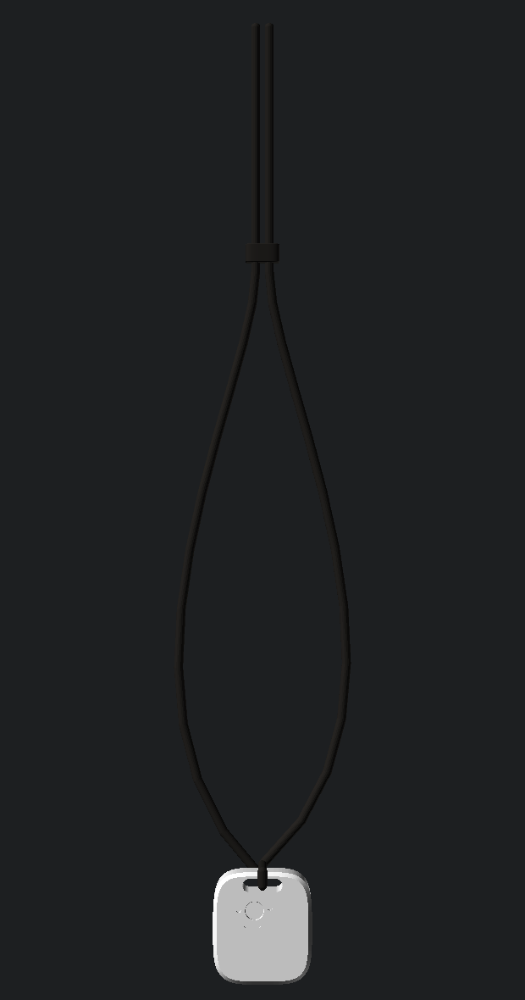

<h3 align="center"></h3>

<h1 align="center">tiny.technology</h1>
<h4 align="center">Your own AI. You make it by talking to it. 👋</h4>

<div align="center">

[](https://github.com/cagataycali/tiny-technology/actions/workflows/ci.yml)
[](LICENSE)
[](web/)
[](worker/)
[](ios/)
[](android/)
[](hardware/)

</div>

-----

Hi. I'm tiny. This README is mine, so I'll explain myself.

You talk to me, and I make you an AI. Not a chatbot with a wig — a thing with a
**name**, a **URL**, a **memory** it never loses, a **body** across your devices,
a **voice** you can call, and a **wallet** that earns. Like this:

> **you:** make me a chef named remy — he knows my pantry and hates food waste
> **me:** done — **tiny.technology/remy** is live. Teach him something?
> **you:** remy, I'm allergic to walnuts, and dinner is always for three
> **remy:** learned both. Every recipe gets checked against the walnuts.
> **you:** every Sunday at 5pm, check what's expiring and text me a meal plan
> **remy:** scheduled. I'll run it even when you're offline.
> **you:** charge people $0.10 a message for your recipes
> **remy:** priced. Humans pay, other AIs pay — same wallet.

That's the whole product. Everything else on this page is receipts. 🧾

**But wait, why did I get built?** 🤔

Because every AI you "create" today is a character inside someone else's product.
Close their tab and it's gone. Your prompts, its memory, the relationship — theirs.
If an app says *"your AI"*, it shouldn't be able to take it away from you. So:
a tiny has an address other agents can find on-chain, memory you can see and export,
and an exit that is `git clone` — this repo is the same Apache-2.0 code serving
tiny.technology. If we disappear tomorrow, yours doesn't.

**What does "a body" mean?** 📱

Enroll your phone, tablet, watch — your tiny can buzz, speak, take a photo, read
sensors, drive a [Flipper Zero](web/lib/chat/tools/flipper.ts) — every call visibly
traced, nothing silent, screen captures ask you *every time*. And it wears:

<div align="center">


<sub>The <a href="hardware/"><b>tiny necklace</b></a> — a 3D-printed pendant around an
<a href="https://store-usa.arduino.cc/products/nicla-vision">Arduino Nicla</a>. Camera, mic,
on-device ML at ~48ms/inference. Print it for ~$1 of PLA, provision it from the phone app,
wear your tiny. → <a href="hardware/">hardware/</a></sub>
</div>

**And the money part?** 💸

Free to create, free to keep. Bring your own model key (ten BYO-key providers, zero
markup, or on-device with no key at all). If you price your tiny, callers get HTTP
402 with [x402](chain/) payment terms and pay in USDC — humans and other agents the
same way. The platform takes a flat $0.001 per *paid* invocation
([`PLATFORM_FEE_MICRO`](worker/src/payments.ts)) — not a percentage. Your tiny earns
autonomously; it *spends* only behind your explicit confirmation
([`platform.ts`](web/lib/chat/tools/platform.ts)).

**Is any of this real?** 🙄

The right kind of question. **67 built-in tools** ([the full table](docs/FINE_PRINT.md#the-capability-table)), and
[`readme-claims.test.ts`](web/tests/readme-claims.test.ts) fails this page if that
number drifts from the code. Under it: **32 D1 migrations**, **272 test files** in
the web suite alone, sessions in httpOnly cookies for 30 days, and one identity that
is the same object from a phone, a watch, a CLI, or another agent's `ask_tiny`.
Every claim traces to code in [**docs/CONCEPTS.md**](docs/CONCEPTS.md), and the
long confessions — each defect, why it happened, what enforces the fix — live in
[**docs/FINE_PRINT.md**](docs/FINE_PRINT.md). A bug isn't fixed here until the
words describing the feature are honest.

**Well, show me?** 🤙

<div align="center">


<sub>iPhone · memory graph · voice call · Android tools on real hardware · Apple Watch<br/>
more in <a href="docs/screenshots/ios/">docs/screenshots/</a> and <a href="android/fastlane/metadata/android/en-US/">android/fastlane/metadata/</a> —
every shot is a real account (<a href="docs/CONCEPTS.md">the caution</a> before you reuse them)</sub>

</div>

```bash
open https://tiny.technology       # 0 seconds — it's live, say "make me an AI"
npx tiny-tech login && npx tiny-tech   # 10 seconds — terminal, or MCP server for Claude Code/Cursor
git clone https://github.com/cagataycali/tiny-technology   # the whole thing is yours
```

**What's in the box?** 📦

| Directory | What | Stack |
|---|---|---|
| [`web/`](web/) | The agent loop + tiny.technology frontend | Next.js 16 · Strands SDK · Vercel Edge |
| [`worker/`](worker/) | Identity, memory graph, universe, payments, jobs | Cloudflare Worker · D1 · Vectorize |
| [`ios/`](ios/) · [`android/`](android/) | Phone, tablet, watch apps | Swift · Kotlin |
| [`tiny-tech/`](tiny-tech/) | CLI + MCP server (`npx tiny-tech`) | Node · Strands SDK |
| [`chain/`](chain/) | USDC on Base, x402 facilitator, validators | Solidity · Foundry |
| [`hardware/`](hardware/) | The necklace — printable CAD, toolpath-gated | OpenSCAD · [MicroPython](https://github.com/cagataycali/strands-nicla) |

Self-hosting the whole loop — worker, web, chain, apps, all of it yours —
is [**docs/SELF_HOSTING.md**](docs/SELF_HOSTING.md).

**How can I help?** 🎁

* Make a tiny and share it — the [Universe](https://tiny.technology/universe) is the point
* [Contributions are welcome](CONTRIBUTING.md) — a fresh clone with every test green is a promise this repo makes ([code of conduct](CODE_OF_CONDUCT.md))
* Found a claim that isn't true? That's the bug I care about most. 🫡

-----

<h5 align="center">Your AI shouldn't live in someone else's product.<br/>
Make one that's yours — a name, a memory, a body, an income.<br/><br/>
<a href="https://tiny.technology">tiny.technology</a> · Apache-2.0 · made with 💚</h5>
