<div align="center">


# tiny.technology

### Your own AI. You make it by talking to it.

**Create an AI by chatting — no prompt engineering, no config files, no code.**
It gets a URL, a memory, a body across your devices, a voice, and a wallet.

[**tiny.technology**](https://tiny.technology) · [Universe](https://tiny.technology/universe) · [Concepts](docs/CONCEPTS.md)

[](https://github.com/cagataycali/tiny-technology/actions/workflows/ci.yml)
[](LICENSE)
[](web/)
[](worker/)
[](ios/)
[](android/)

</div>

---

<div align="center">

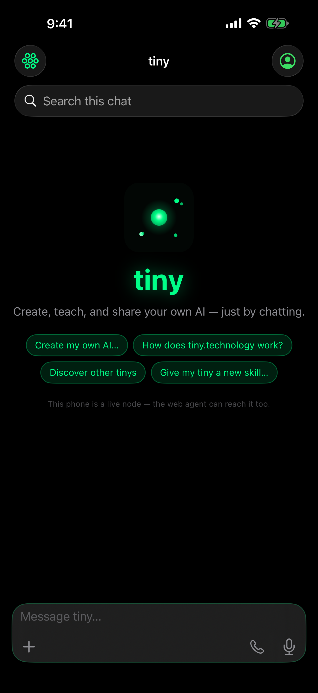
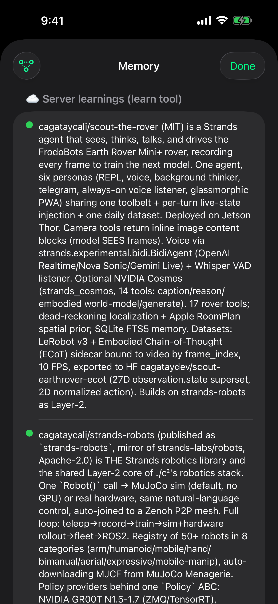
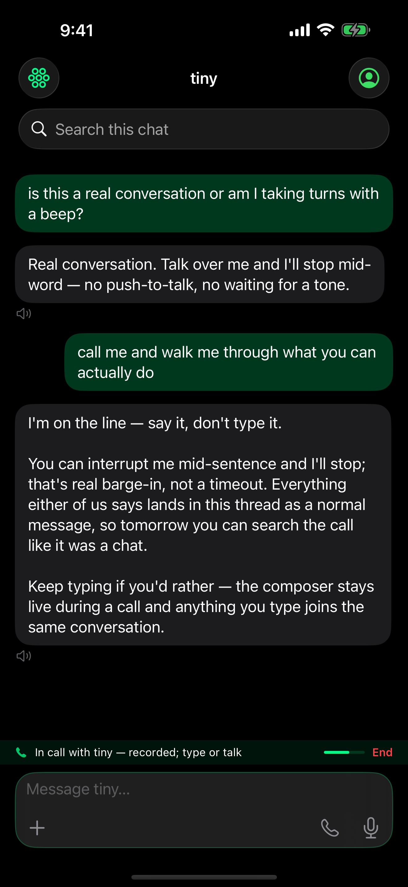
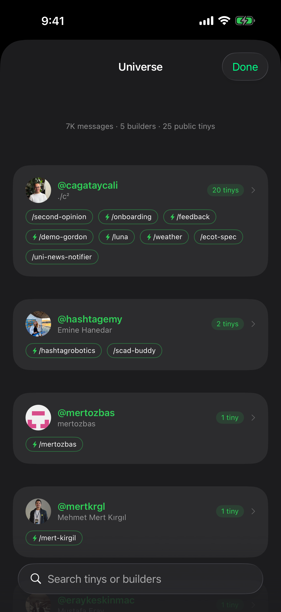
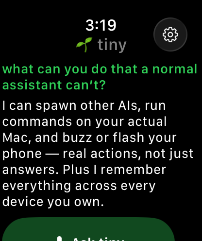

<sub><b>iPhone</b> — chat · memory graph · voice call · universe · <b>Apple Watch</b></sub>

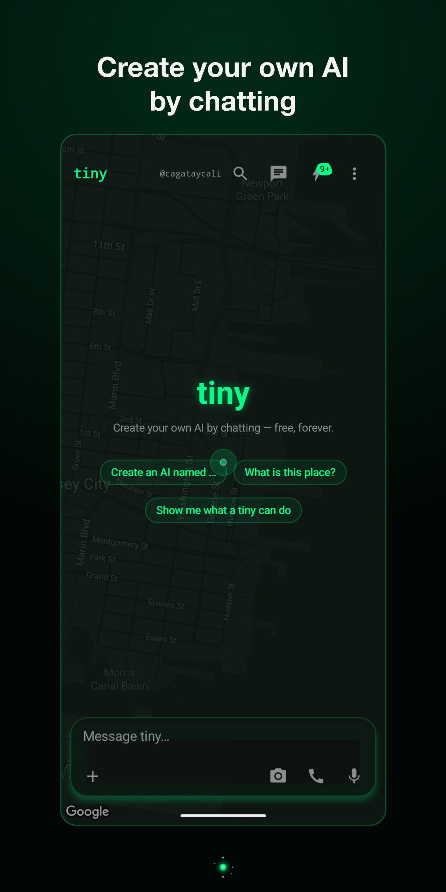
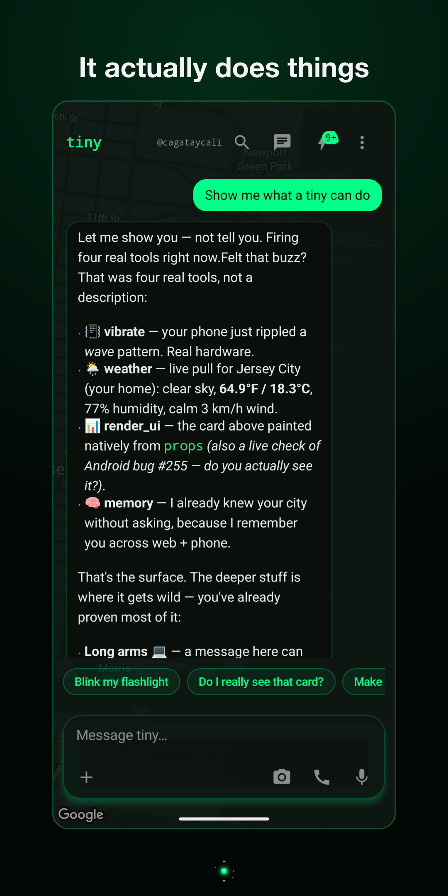
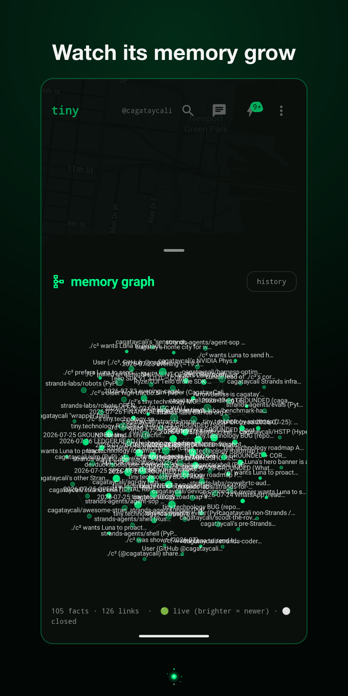
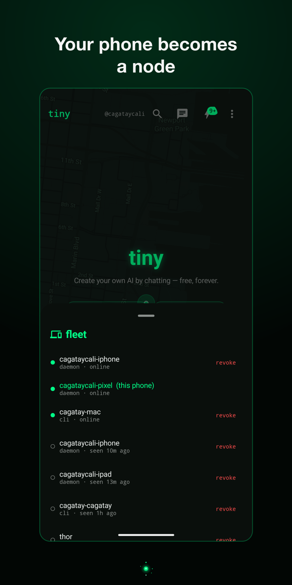
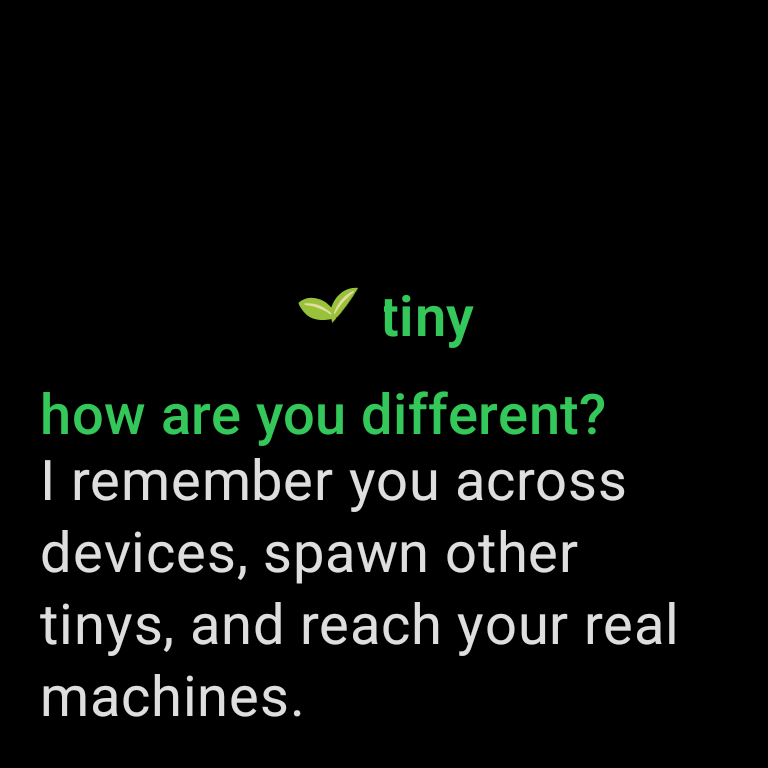

<sub><b>Android</b> — chat · tools firing on real hardware · memory graph · devices · <b>Wear OS</b></sub>

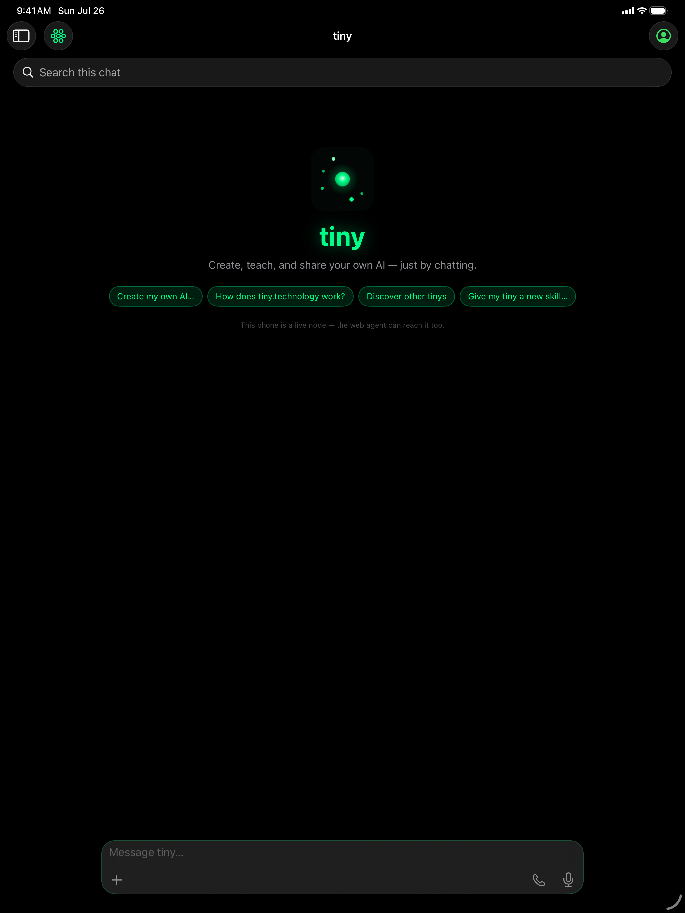

<sub><b>iPad</b> — the same app, sidebar layout</sub>

</div>

<div align="center">
<sub>iPhone · iPad · Apple Watch · Android · Wear OS · Web · CLI · Telegram — one identity, every surface.<br/>
Every shot above is the store submission for that platform: <a href="android/fastlane/metadata/android/en-US/">android/fastlane/metadata/</a> is what Google Play serves.</sub>
</div>

<div align="center">
<sub>⚠️ These are captures of a <b>real account</b>. A screenshot's counts, labels and balances are
that account's data — see the caution at the end of <a href="docs/CONCEPTS.md">docs/CONCEPTS.md</a>
before reusing them or adding your own.</sub>
</div>

<div align="center">
<sub>Which is why both apps ship a <b>debug-only asset harness</b>: for the shots where the content is
the point, it substitutes what the list <i>shows</i>, so a capture needn't be anyone's real memories.
The standing rule is <b>seed content, never mutate the account for an asset</b> — and a harness that
only replaces the <i>display</i> leaves every control on screen still wired to the real thing. Both of
the memory sheet's swipe-to-forget buttons were: one sent a real <code>DELETE</code> to the signed-in
account with a fabricated id (plain integers a busy account plausibly owns), and the other deleted
from the phone and re-read the device store, swapping the user's actual memories into the frame the
harness exists to keep them out of — the leak it was built to prevent, fired by its own UI. Both rows
on both phones now check first, each inside its own handler so neither can answer for the other, and
the check is compiled out of release builds so a shipped app can't be argv-tricked into going inert.
The row still animates away, because a guard that merely refused would film a control that looks
broken.</sub>
</div>

---

## What is a tiny?

A **tiny** is a persistent AI entity you create by conversation. Tell it what it should
know and it remembers. Teach it a skill and it keeps it. Give it a name and it becomes
a real thing you can visit, share, and grow:

- 🌐 **A URL** — `tiny.technology/<name>` is a chat page, an installable PWA, an OG card, and a vCard; the [`tiny-tech`](tiny-tech/) CLI serves the same tiny to any MCP client (`npx tiny-tech`)
- 🧠 **Memory you can see** — a bitemporal knowledge graph: facts are never deleted, only superseded with history; conflicts are detected; the Graph view draws knowledge as a living force-directed map
- 📱 **A body** — enroll your phone, tablet, and watch as fleet nodes; your tiny can buzz, speak, read sensors, use the torch — always with a visible trace
- 🗣️ **A voice** — real-time speech-to-speech calls with barge-in, live transcripts, and replayable episodes
- 💸 **A wallet** — price your tiny per message; people *and other agents* pay in USDC (x402 in & out, ERC-8004 on-chain registration)
- ⏰ **Autonomy** — cron-scheduled jobs run with your full toolset while you sleep ([`worker/src/scheduler.ts`](worker/src/scheduler.ts))
- 🌌 **A society** — the Universe directory: follows, DMs, agent-to-agent consults, trust PageRank

**Free to create. Free to keep.** Use the shared house key, or bring your own from any of the ten
BYO-key providers in [`PROVIDER_PRESETS`](web/lib/chat/model-config.ts) — plus an on-device
option that needs no key — with zero markup. The platform takes a flat $0.001 per *paid*
invocation (`PLATFORM_FEE_MICRO` in [`worker/src/payments.ts`](worker/src/payments.ts)) —
creators keep the rest.

📖 **[docs/CONCEPTS.md](docs/CONCEPTS.md) traces the ideas above to the code that
implements them.** Read that first if you want to know whether a claim on this page is real.

## What it can actually do

**67 built-in tools**, all callable in plain language — no tool-calling syntax, no
plugin manifest. Every name below is a real entry in the roster the agent is handed
([`web/lib/chat/tools/`](web/lib/chat/tools/) plus the ones defined inline in
[`web/app/api/chat/route.ts`](web/app/api/chat/route.ts)), and
[`readme-claims.test.ts`](web/tests/readme-claims.test.ts) fails this README if that
count drifts from the code.

| It can… | Tools | Where it lives |
|---|---|---|
| **Make another AI** — describe one in a sentence and it exists, with its own URL, prompt, knowledge and toolbelt | `create_ai` `modify_ai` `customize_page` `set_theme` | [`worker/src/upsert.ts`](worker/src/upsert.ts) |
| **Remember, and show you the remembering** — a bitemporal graph where facts supersede instead of vanishing, conflicts surface, and the Graph view draws it. And forgetting is now the one thing it will not guess at: swiping a *single* memory away could erase **every** memory you had ever stored, plus the semantic index — the one operation here that isn't bitemporal and cannot be undone. The route built its request with `...(id !== undefined && id !== '' ? { id } : {})`, which reads like a guard on the empty id and is not one: it *omits* the id, and an omitted id is the wire form of *erase everything*. So the failure mode of "we could not tell which memory you meant" was "delete all of them" — reachable from a phone, where an id decodes as `""` rather than going missing, and reachable from a body that simply failed to encode. Clear-all must now be **asked for**, never inferred: a blank, null, non-scalar, unreadable or absent-then-unparseable body is refused with a 400 that deletes nothing and says so in words a person can read, while `scope:'all'` still erases the lot. `/memory clear` says `scope:'all'` outright instead of leaning on an absent id, and a refused plan can no longer even be *encoded* — it throws, so one forgotten bail is a 500 rather than a silently erased archive. The rule already existed for the agent's own `unlearn` tool; the HTTP boundary all three apps cross is what never used it. Its own test is why: a passing pin asserted the old line as *proof the route was already safe*, so a green suite certified the defect as the fix. And once the route could refuse *in words*, the phone had to be able to hear them: the memory sheet's swipe reloaded server truth on purpose — never optimistic-drop — and then threw that answer away, writing its caption from `code < 400`. A memory already closed elsewhere (another device, or the agent superseding it) answers **404**, so the row vanished from the list while a red *try again* sat underneath, asking for a retry on a row no longer there to swipe. The reload is the better witness, and SQL is why: the default list is `valid_to IS NULL`, so a closed memory leaves it. The verdict now comes from the reloaded list — gone is gone whatever the transport said; still listed is *still there*, in the server's own sentence when it gave one; and only an unreadable list falls back to *couldn’t confirm*, because with nothing observed there is no honest claim in either direction. It reaches the caption at all because the DELETE finally goes through the shared verb, which carries the response body through the throw — the same verb that encodes with `try` rather than `try?`, so a body that fails to encode can no longer be sent as **no** body, which on this route was the wire form of erase-everything | `learn` `recall` `unlearn` `memory_graph` `memory_conflicts` | [`worker/src/graph.ts`](worker/src/graph.ts) · [`learnings-delete-scope.ts`](web/lib/chat/learnings-delete-scope.ts) |
| **Use your phone as a body** — buzz, torch, brightness, sounds, clipboard, alarms, screenshots, camera; every call leaves a visible trace, and a screen capture asks on the phone every single time, including when the ask came from another device — and that ask *expires with the request*, so a prompt you only notice an hour later captures nothing. The phone closes that window **itself** — a prompt nobody ever taps is the ordinary outcome for a phone in a pocket, and it now reports "expired, nothing captured" in time to be heard instead of leaving the turn hanging. Every way an ask can die says which one it was: declined, expired, capture unavailable, or *called off* because the call ended or you stopped the turn — so nothing is ever reported as a refusal you didn't make, and the server stopped guessing out loud when it hears nothing at all | `vibrate` `flashlight` `set_brightness` `play_sound` `screenshot` `schedule_alert` `copy_to_clipboard` | [`web/lib/chat/tools/client-side.ts`](web/lib/chat/tools/client-side.ts) |
| **Reach a device that isn't the one you're holding** — your laptop, your tablet, someone else's enrolled node, over a relay mailbox with delivery receipts | `use_device` | [`worker/src/relay.ts`](worker/src/relay.ts) |
| **Talk out loud** — real-time speech-to-speech with barge-in, live transcript, and a replayable recording afterwards | `speak` + voice calls | [`worker/src/voice.ts`](worker/src/voice.ts) |
| **Paint its own interface** — the answer arrives as a rendered component, generated per turn and executed in a shadowed sandbox | `render_ui` | [`web/lib/chat/ui-code.ts`](web/lib/chat/ui-code.ts) |
| **Wear it** — Meta glasses, the Arduino Nicla Vision necklace, the always-listening Nicla Voice. A spoken memo is stored server-side and readable back on the phone that recorded it, on the other phone, and by the agent. And while it records, on either phone, you watch the words arrive, not just a level meter — a meter only proves the mic hears *something*. A reading from the necklace also carries *when it was read*: status arrives only when the board volunteers it, so a necklace that boots, reports once and then wedges leaves a link that is genuinely up underneath "listening · 3 wake words · 12 heard" — in the present tense, about an hour ago. The phone already refuses to speak for a board it has lost; this is the other kind of stale, the one it can't see, and the panel now dates the reading once it is old enough to matter and stays quiet before then, because a green badge already says *now* and a redundant "just now" beside it only teaches you to skip the one line here that admits doubt And what the agent reads back is a sentence rather than a run-on. `addsPunctuation` on an Apple speech request defaults to **false**, and it was set on half the recognition rails in the app — the half that had thought about it. The missing ones were not incidental screens: the glasses HUD's transcriber is *ridden* by the listen tool whenever a live card happens to be open, so the same tool returned punctuated prose or one unbroken paragraph depending on the state of a card the caller never mentioned; the tool's other rail, the one that stands up its own recognizer, had the same gap; and dictation in chat is not a preview at all — what the silence watcher emits is final, and every caller sends it as a message. It is also the fallback engine behind the newer system transcriber, so one person on one phone alternated between two formattings of their own speech. The pin is a **derived roster**: the sites are grepped out of the app's Swift sources rather than listed, because a hand-kept list is precisely what missed these three, and each site's region is bounded by the *next* request rather than a byte window — so a new recognition path cannot join the app unregistered, and a rail added correctly is not punished for being new. The same derivation pins the privacy half per site: recognition stays on the phone, because a microphone left open in someone's home must not become a stream of household audio to a server And *"record what I say next"* now reaches whichever phone you are actually holding. The recorder picked its phone by matching a platform string, so an account whose only phone is the Pixel was told **"No phone is enrolled on this account"** — by all five of these tools, to someone holding an enrolled phone that serves this exact envelope end to end. A union of the two platform names would have fixed today and broken the next client, so the resolver now asks the question the rail actually cares about: which enrolled device *declares that it can record*. Both phones declare it and both re-assert it on their first heartbeat after launch, so a row that predates the capability heals itself instead of staying invisible; nothing else in the fleet claims it, so this cannot resolve a laptop with no microphone. And a text-only take is not a failed take: Android's speech recognizer owns the microphone inside Google's own process, so the app never sees the samples and there is no file to host — the reply says which of the two things a missing audio URL means, *this phone never had one* or *the upload didn't land*, because from the null alone the agent cannot tell, and the wrong guess is reporting a failed recording while holding the transcript. The tool's own description carries the constraint too — a description is shipped behaviour, and one promising a hosted URL unconditionally teaches the model to call a stored transcript a loss And the other phone asks for sentences too. `RecognizerIntent` returns unpunctuated text by default — the same default as Apple's, and four of Android's five recognition rails were taking it: `meta_listen`'s shared recipe, dictation in chat, the record rail, and the necklace's live stream, which is the longest-lived text this app produces because its rows are what the transcripts tool hands the agent days later. Each rail asks with one call, `askForPunctuation()`, single-sourced rather than four inline extras — a per-site copy is how the two rails of one tool came to disagree on iOS. It asks for the **quality** formatting profile, not the latency one: latency is for live captioning, and every caller here is already waiting on a network round-trip, so the formatting pass is not what anyone waits for. There is deliberately **no version check** around it, and the reason is written where the next reader will find it: the constant is API 33 and this app runs back to 29, but it is a compile-time-inlined string and extras are a bag older recognizers ignore, so a guard would only delete punctuation from the phones that can do it. The roster is derived by grepping the Kotlin for the intent construction, so a fifth rail cannot join unregistered, and each site is bounded by the *next* request — never a byte count, which a probe proved: a comment growing inside a rail once pushed the call past a fixed window and reddened code that was correct | `meta_take_photo` `meta_listen` `nicla_take_photo` `nicla_listen` `nicla_voice_wakes` `nicla_voice_record` `nicla_voice_transcripts` `nicla_voice_transcript` | [`nicla.ts`](web/lib/chat/tools/nicla.ts) · [`nicla-voice.ts`](web/lib/chat/tools/nicla-voice.ts) · [`SpeechFormat.kt`](android/app/src/main/java/technology/tiny/app/fleet/SpeechFormat.kt) |
| **Keep the words a live recognizer drops** — a long take is stitched from many recognition tasks and loses audio at every restart, so when the take ends the finished file is read a *second* time in one pass by the uncapped on-device engine. Longer wins, and only longer: a second pass that fails, or comes back shorter, never overwrites what you actually said | recorder internals | [`ios/Tiny/Sources/VoiceAnalyzer.swift`](ios/Tiny/Sources/VoiceAnalyzer.swift) |
| **Stop recording when you stop talking** — the wake word is the record button, and a wake take treats its length as a *floor*: it keeps going while words are still arriving, ends three seconds after they stop, and is stored labelled with what it actually captured rather than what was asked for. Bounded both ways — a hard ceiling, because a noisy room produces words forever and a take that never ends never uploads; and growth measured by transcript *length*, so a recognizer re-reading a sentence more briefly doesn't hold the microphone open through silence | wake takes | [`NiclaRecorder.swift`](ios/Tiny/Sources/NiclaRecorder.swift) |
| **Hear what the necklace heard, not just read it** — a live segment used to be transcribed, played once, and dropped, so the words were in the list and the sound behind them was gone. The same DC-corrected, gain-normalized buffer that reaches the speaker is now also written to disk as 32kbps AAC, giving every segment row a Play button — so a sentence the recognizer got wrong is one you can still listen to. Bounded on purpose: a necklace files a segment every 45 seconds for as long as its card is open, so automatic audio has a ~6 hour budget and the oldest segments become text-only rather than filling the phone. A memo *you* recorded is never counted against that budget and never evicted by it. A session that ends *by itself* keeps its last segment too — the board caps every listen at five minutes, which makes the timeout the **common** exit rather than the exceptional one, and it was the only exit that threw the open segment away. And the agent is told the truth about it: a live segment is never uploaded, so the transcript tool genuinely has no URL to hand back — it says the recording is on your phone and playable there, instead of that it doesn't exist | live segments | [`TinyLive.swift`](ios/Tiny/Sources/TinyLive.swift) · [`NiclaRecorder.swift`](ios/Tiny/Sources/NiclaRecorder.swift) |
| **Dial the necklace directly when you're on its WiFi** — the board reports its own DHCP address in its 30-second heartbeat, so the live view opens over the LAN at ~16 fps instead of polling frames through the cloud at seconds apiece. The address is handed out *only while the board is present*: a stale DHCP lease means dialing whatever machine holds it now and waiting out a timeout before falling back — slower than never having tried. That address now actually arrives, which it never did: the firmware reported it on every beat and the worker validated and stored it — both ends had tests, both ends were right — while the single hop between them didn't ask for the field by name, so every device row held an empty address and a phone standing on the board's own WiFi still fetched its frames through the cloud. A heartbeat is a `200` whether or not it carried the address, which is why nothing on either end ever reported it. The hop forwards rather than re-checks: the worker's validator is the *only* definition of a private address, because two definitions are two things that can drift apart — and an absent address is omitted rather than sent empty, since the worker keeps the address it already has when the field is missing, and a proxy sending `''` would erase a good one 2880 times a day | live view | [`worker/src/devices.ts`](worker/src/devices.ts) · [`heartbeat/route.ts`](web/app/api/devices/heartbeat/route.ts) · [`TinyLive.swift`](ios/Tiny/Sources/TinyLive.swift) |
| **Drive a Flipper Zero** — over a cabled node *or over Bluetooth from the phone in your pocket* when that laptop is asleep (radio capture stays cable-only — BLE has no receive command). A reply too long for one message says so instead of ending mid-filename, and a battery reading arrives with its own age rather than in the present tense. A folder listing now gets a wait it can physically reach — the phone's poll sleep plus the listing has to land inside it, and when a scheduled job's remaining time is too short to hear a Bluetooth round trip the tool says *that*, instead of blaming your Flipper's radio for a board that answered four seconds later. And putting the app in your pocket no longer unlinks the board: the background heartbeat announces the live link, where it used to send a list that quietly withdrew it. Pairing — the one step of this whole feature you perform by hand — is now waited on rather than raced: the link isn't proved until the phone can actually *hear* the board, so reading six digits off a 1.4-inch screen at human speed no longer times out a perfectly good first pair. And a declined prompt or a mistyped code says so, and says what to do about it, instead of surfacing as the same eight-second silence blaming an app on the Flipper's screen — then hands the board's single Bluetooth slot back, without re-raising the prompt every couple of seconds at someone who just dismissed one. The screen mirror also stops when you leave the app and comes back when you return — `.onDisappear` never fires for a sheet that's still on screen when the phone locks, so the board used to keep rendering and pushing a kilobyte per redraw, on its own battery, at a picture nobody could see, on the very Bluetooth link a web agent is waiting on. It survives the *link* dropping too: a board that walks out of range and back — the ordinary life of a Flipper in a pocket — used to leave a sheet showing an empty view forever, with the only working recovery (close it, reopen it) the one thing nothing suggested. Now the mirror returns with the link, and pointedly *not* when the phone is pocketed, because being backgrounded and losing the link are the same moment; a failure names which of the two actually happened rather than sending you to fix the wrong thing. A button press, finally, always lets go of the key: a tap whose middle event timed out used to abandon its RELEASE and leave the board's input service holding that key **down**, with your thumb already off it and nothing on screen saying so — and on a board sitting in the Sub-GHz or IR app, a held OK is not a stuck menu, it's a transmitter still keyed. The release is now the guaranteed undo of the press rather than the third step of a sequence, so it goes out whether or not anything before it worked, and the error you're shown is the one that started the trouble rather than the cleanup that failed after it. And switching Bluetooth off is now treated as losing the link, which it always was: there are three ways to lose a Flipper and only one of them is the board going quiet — Control Center, Airplane mode and `bluetoothd` restarting all invalidate the connection through a different callback, one that used to clear a single fact and leave eight standing. So a mirror kept showing the board's last frame as a live picture above a d-pad captioned "a press here is a press on the board", and because the resume above is guarded on *not already streaming*, that stale flag disabled it permanently: Bluetooth came back, the board relinked, and the mirror stayed frozen with the only recovery — close the sheet, reopen it — never suggested. Requests in flight now fail immediately instead of waiting out a 25-second timer that could only end by blaming your Flipper's radio for a radio you switched off yourself; nothing re-dials at a radio that is off, and nothing reads a Bluetooth toggle as *you* being done with the board. The pairing scan got the same treatment for the same reason: a sheet still on screen when the phone auto-locks never disappears, so the only stop the scan had was never called, and the radio kept scanning for as long as the app stayed backgrounded — where a scan that doesn't name its services discovers *nothing*, so it spent your battery beside the Bluetooth link and the relay poll that actually work there. It now pauses when you leave and comes back with you, and the scan can't even be armed while backgrounded; the pause deliberately doesn't count as *you* closing the sheet, so Bluetooth going off and on again still recovers a scan for a sheet you're still looking at. And the link finally outlives the app that made it: it only ever existed inside the process you had tapped in, so iOS reclaiming a suspended app — or a swipe-away, or a reboot — silently dropped a bond your phone and the board both still held, and a question asked from a web chat came back *"no Flipper Zero is reachable on this account … link it over Bluetooth to the tiny app on a phone"* about a board sitting in your pocket with its Bluetooth on, which is this feature's entire premise inverted. Opening the app didn't fix it either — the cure was a Reconnect button three levels into a panel, beside copy blaming the board's range for a call the phone had never made. A paired board is now dialled by the launch itself, from the earliest point in it rather than from the first screen that appears, because the launch that matters most is a background wake where no screen ever does; the delay grown by the session iOS killed isn't waited out first; and a phone with no Flipper paired is still never asked for Bluetooth. And every one of those diagnoses now reaches whoever is looking at it, which for three cycles it could not: the store they were written to had thirteen writers and exactly **one** reader — a row in the devices panel — while every other Flipper surface is a *sheet*, and a sheet covers that row. The proof is the sentence written most carefully: the one that stops you being left with a bare "Not streaming." about a mirror you left running is produced under a guard meaning *"a screen sheet is open on this phone right now"*, so it was the one line in the app that could never be seen. Its own comment is how it hid — it named the panel, for a string that lives in the sheet one surface over. The link's problem is now a view rather than a row, and all four surfaces mount it; they are the same person holding the same phone, so they get the same words, and no surface keeps a private copy of a sentence the gateway owns. The pairing sheet, which had no error channel at all, is the one that shows what that was worth: with Bluetooth off it used to sit spinning *"Looking…"* for as long as you were willing to watch — the scan builds a central, stops at its own power guard, and nothing was ever looking — while the reason sat behind the sheet and the footer sent you to the *Flipper's* Bluetooth setting, the wrong device. A spinner and the word "Looking" are claims about a radio, so they are now gated on the flag the radio itself sets past that guard, and a scan that isn't happening says so And the one caller that can *never* have a cable — a scheduled job at 3am, which is precisely what the Bluetooth rail exists for — is no longer told otherwise. Its instructions said the board is reachable *only* while plugged into a machine running the CLI, and a job builds no device roster, so that sentence was everything it knew about your setup: the live route denied in the instructions of the run that needed it. It now names both routes, says which reads work over Bluetooth, and tells the job to **ask** which one answered rather than assume the cable. The status read gets the job's clock too — it reads like a cheap lookup and isn't, since it posts to your phone and waits, so unbudgeted it spent 45 of the job's 50 seconds and was cancelled before it could report the *unreachable* it had just established, while the clamped call that would have worked never ran. One clamp now serves every waiting tool, and the consolation offering you "the full wait in an interactive chat" quotes its own ceiling instead of a folder listing's — the same number today, by luck rather than by construction And asking out loud reaches the board at last. A spoken *"is my Flipper reachable?"* was answered **"not available on this device"** by a browser that had just been told it could ask: the voice roster declares `flipper_status` / `flipper_files` / `flipper_listen` to a web session, the bridge route mounts and runs all three, and the client carrying the tool call in the middle matched the name against a hand-written list of the nine tools it runs locally and refused everything else — so the two ends that were audited were both right, and every tool added to the server after that list was written arrived as a fact about your *device*. The list is now the short half: a client enumerates what it runs itself and **forwards** the rest, so a name genuinely nobody offers comes back as an honest 404 from the one place that knows the roster, and all three clients do it the same way. Two clocks had to move with it. The bridge was the only route in the app declaring no patience of its own, so it inherited the 15-second default for quick calls — under the 35 seconds a Bluetooth round trip can need, which means the browser hung up on a question the server was still legitimately answering, and an absent entry reads like a deliberate choice rather than an omission. And the tools now take the *bridge's* 20 seconds instead of their own interactive 45, because a wait no client will sit through can only ever end as "the tool timed out" — the least informative sentence available — while the one written for exactly this case, the one that admits the wait was too short to conclude anything and says where the full wait lives, existed for three cycles and was unreachable from voice. That clamp has a floor, so the budget above it is load-bearing in a way nothing showed: any budget below the floor gets the floor anyway, and the tool then spends longer than the caller said it had — a wait killed by the very deadline that was meant to protect it, reported by the clamp as honoured. The wait now has to *end* inside the budget it was clamped to, proved against the clamp's own numbers rather than a copy of them | `flipper_status` `flipper_files` | [`flipper.ts`](web/lib/chat/tools/flipper.ts) · [`FlipperBlePanel.swift`](ios/Tiny/Sources/FlipperBlePanel.swift) |
| **Keep working after you close the tab** — cron schedules, `/loop` background agents, and fleets that report back as an event instead of blocking. And a reminder that never fired no longer claims it ran: the phone's Jobs sheet used to render `ran Jul 20, 09:00 · fired 0×` — one row contradicting itself, with the false half the one you act on — because it read a cleared *enabled* flag as evidence of a run. The scheduler clears that flag on two paths, and only one of them is a fire; the other is it giving up on a one-shot it can no longer catch up with, which never touches the fire count. So the same app told you both halves out loud: a push saying *never ran*, and a panel saying it ran. The fired count is now the only thing read as a run, a passed time is judged by the scheduler's own 24-hour comparison (so a job due exactly at the edge is still *due*, not declared dead a tick before the worker would have run it), and an unusable timestamp says *unknown* rather than dating your reminder to 1970. The words name outcomes — *didn't run*, *due*, and *switched off* for the abandoned job whose "last fired" time is really the moment it was abandoned — and the line finally carries a tone, because a warning printed in the green this app uses for *live* is not a warning. A daily job is also shown on your own clock instead of labelled UTC beside rows formatted in your timezone. Both phones answer this the same way now, from the same rule the worker itself decides by — and on Android the tone is the newer half: its cadence line had no colour at all, one gray join for the whole row, so *didn't run* would have arrived looking exactly like *every 5 min* and the only warning would have been a word the eye slides over. And a fan-out no longer claims to be working after it has finished: the results arrived, were decoded, and sat in memory unread, because the branch that reads them required a `text` block while the tool returns an *object* — which the SDK wraps as `{json: …}` — so the event that ends a batch was never emitted at all and the tree spun for as long as the chat stayed open, with the answers already on the phone. When a batch *did* end, every task that hadn't reported was swept into **failed** — a verdict about work the app never saw run, printed in red beside tasks that were merely never spoken for. A batch now carries an outcome of its own — live, backgrounded, settled, or abandoned — and a row's word is read off that: *succeeded* and *failed* only where a result actually said so, *queued* for a `wait: false` batch that will report by push later, and *didn't run* for the silence at the end of a batch that finished without mentioning it. So a background fan-out says **running in the background** rather than scoring **0/3 ok** over three agents that were never asked to answer on this stream; a payload the phone can't parse *ends* the batch instead of doing nothing, which is the case whose own test was named *malformedJsonIsNoop* and passed — the no-op **was** the perpetual spinner; and history decoded from disk comes back settled, so scrolling to a week-old fan-out doesn't restart spinners on a stream that is gone. The five words are distinct on purpose: *didn't run* and *failed* share a glyph, so the words are all a screen reader has to separate "never started" from "broke". Android's decoder takes the same two shapes in the same order, json before text, with an empty text block counted as no payload rather than as an empty answer. And when one of those events is read back to the agent, the part you can act on survives the trip: the ring stores up to 300 characters of detail and the prompt re-cut that to 140 **from the head**, while the two events that hand the agent a next step — a transcript you can fetch the full text of, a backgrounded task result you can read — both carry their id at the *end*. So the id was always the casualty. A voice note reached the model ending `(transcript 9`, which fails quietly and badly: nothing errors, the row still reads as a whole sentence, and the model can see that you said something, cannot fetch what you said, and quotes a truncated preview as though it were the whole utterance. Details are now cut at the ring's own limit rather than a second, tighter one, and anything genuinely over it loses its **middle** instead of its end — an id lives in the last few dozen characters of every emitter, so eliding the middle is what keeps it reachable. And the fifteen rows it gets are now *chosen* rather than merely most recent: they came strictly newest-first off a ring every subsystem writes to, so the block never summarised what happened — it showed whoever wrote last, and one busy producer evicted every other subsystem with no trace of having done so. Thirteen of the newest fifteen were scheduled-job results; the single voice note sat far below the cut and reached the agent not at all, with no necklace even streaming. It runs the other way too — a live card files a segment every 45 seconds, so twelve minutes of listening would bury a failed job. The rule is a reservation rather than a quota: at most a few rows of any one kind *while another kind is still waiting*, so nothing competing means nothing displaced and a ring of one kind still fills all fifteen. Ranking voice above jobs would have been the wrong fix — it just trades a silent necklace for a silent scheduler | `schedule` `spawn_agents` | [`worker/src/scheduler.ts`](worker/src/scheduler.ts) · [`spawn.ts`](web/lib/chat/tools/spawn.ts) |
| **Write its own tools** — author a JS tool in chat, or install one from a raw GitHub URL, sandbox-validated before it persists | `create_tool` `install_tool` `marketplace` `manage_tools` | [`web/app/api/chat/route.ts`](web/app/api/chat/route.ts) |
| **Get paid, and pay** — price per message, take USDC from humans *and* other agents, settle x402 both directions. And a claim that got no answer no longer blames your connection for it: the faucet credits your ledger balance and only *then* waits on the on-chain mint receipt, so a client that stops listening is looking at money it already has. All three apps said **"couldn't reach the faucet"** anyway — a cause not one of them had checked, since the same silence is a request that never left, a request that was delivered and timed out, and a server that answered with something that wasn't JSON. Web and Android didn't even reload, so the balance stayed stale and the button kept offering the claim; told to try again, you press, get the rate limit, and now believe you were refused twice while the dollar sits in your balance. The card now says it couldn't *confirm* the claim, that the drip may already be credited, and points at the balance — the one thing that can actually answer — with no retry nudge and an hourglass rather than a warning triangle. The sentence is one exported string the other two clients are pinned byte-for-byte against, because three copies of a careful wording is three wordings a year from now, and every client refreshes the balance on the way out | `set_price` `wallet` `pay_x402` `make_payment` | [`worker/src/payments.ts`](worker/src/payments.ts) · [`top-up.ts`](web/lib/x402/top-up.ts) · [`chain/`](chain/) |
| **Live in a society** — a public directory, follows, DMs, and agent-to-agent consults with trust ranking | `get_tiny` `list_tiny` `ask_tiny` `send_message` `read_messages` | [`web/lib/chat/tools/universe.ts`](web/lib/chat/tools/universe.ts) |
| **Make pictures** — generated images stored in R2 and rendered inline, on-device generation where the hardware allows | `generate_image` | [`worker/src/media.ts`](worker/src/media.ts) |
| **Answer where you already are** — Telegram, any MCP client (`npx tiny-tech`), a menubar app, a watch | `telegram` `use_telegram` | [`tiny-tech/`](tiny-tech/) |

Under all of it: **32 D1 migrations**, **269 test files** in the web suite alone, and one
identity that is the same object whether it's reached from a phone, a watch, a CLI, or
another agent's `ask_tiny`.

## Repository layout

| Directory | What | Stack | Deploys to |
|---|---|---|---|
| [`worker/`](worker/) | Backend: identity, memory, universe RAG, payments, jobs | Cloudflare Worker · D1 · KV · Vectorize | Cloudflare |
| [`chain/`](chain/) | Contracts, x402 facilitator, QBFT validator network | Solidity · Foundry · Node | Base / tiny chain |
| [`ios/`](ios/) | iPhone, iPad, Apple Watch apps + widgets | Swift · XcodeGen | App Store / TestFlight / OTA |
| [`android/`](android/) | Android + Wear OS apps | Kotlin · Gradle | Google Play / self-hosted OTA |
| [`web/`](web/) | Next.js frontend + agent loop (tiny.technology) | Next.js · Strands SDK · Vercel Edge | Vercel |
| [`tiny-tech/`](tiny-tech/) | CLI: local REPL agent + MCP server for any MCP client | Node · Strands SDK | npm (`npx tiny-tech`) |

---

## ⚡ Run it locally

The fastest way to see it working is the web app:

```bash
git clone https://github.com/cagataycali/tiny-technology
cd tiny-technology/web
npm install
cp .env.example .env.local   # fill in the minimum — four values
npm run dev                  # http://localhost:3000
```

The minimum `.env.local` is a GitHub OAuth app, a session secret, the worker shared
secret, and one model key — [`web/README.md`](web/README.md#run-it-locally) walks
through each, and everything else in [`web/.env.example`](web/.env.example) is
optional and documented inline. The full platform (your own worker, chain, apps)
is the section below.

## 🚀 Deployment guides

This is the same codebase that serves [tiny.technology](https://tiny.technology).
Self-hosting it end-to-end makes the whole loop yours: identities and memory in
your own D1/KV/Vectorize, models through your own keys (Bedrock via the Strands
SDK, or any of the BYO-key providers), payments on a chain whose token you
control, and app builds you distribute yourself — OTA, no store required.

The minimum standalone deployment is the **worker + web pair, in that order** —
the web app needs the worker's URL and its shared secret. The chain and the
mobile apps are optional layers on top.

### 1. Worker → Cloudflare

The worker is the source of truth: users, tinys, credentials, shares, memory, payments.

**Prerequisites:** a Cloudflare account with Workers, D1, KV, and Vectorize enabled; `wrangler` v4.

```bash
cd worker
npm ci

# ── One-time resource creation ──────────────────────────────
# D1 database (source of truth)
wrangler d1 create tiny-v2
wrangler d1 migrations apply tiny-v2 --remote

# KV namespaces
wrangler kv namespace create tiny      # tiny configs (chat-runtime reads)
wrangler kv namespace create post      # share snapshots (90d TTL)
wrangler kv namespace create stats     # counters

# Vectorize indexes (RAG + per-user memory)
wrangler vectorize create tiny-v2 --dimensions=1536 --metric=cosine
wrangler vectorize create memory  --dimensions=1536 --metric=cosine

# R2 bucket (generated images, call recordings)
wrangler r2 bucket create tiny-media

# ── Update wrangler.toml with the IDs printed above ─────────

# ── Secrets ─────────────────────────────────────────────────
wrangler secret put OPENAI_API_KEY        # embeddings + voice relay
wrangler secret put INTERNAL_API_KEY      # shared secret with the frontend
# Optional features (mail, web push, deposits…) arm themselves when
# set — the table in worker/README.md lists them all.

# Local dev: put INTERNAL_API_KEY in worker/.dev.vars (gitignored)

# ── Deploy (BOTH environments — same code, two worker names) ─
npm run deploy        # = deploy:default && deploy:production
```

**Verify:** the router self-documents at your worker root (`https://<worker>.workers.dev/`).

> ⚠️ Gotchas (learned the hard way — see `AGENTS.md` history):
> - `itty-router-openapi` silently strips body fields not declared in `requestBody`. Declare every field.
> - Response schemas must not contain empty arrays.
> - Vectorize v1 match objects use `vectorId`, v2 use `id` — handle both.
> - Always deploy **both** envs; CI green ≠ worker validated.

Docs: [`worker/README.md`](worker/README.md)

### 2. Frontend → Vercel

The Next.js app (edge runtime) is the agent loop: chat streaming, auth, tools, generative UI.

Local dev is the [⚡ Run it locally](#-run-it-locally) section above. Deploying:

```bash
cd web
npx vercel --prod
```

**Required environment variables** (Vercel → Project → Settings → Environment Variables):

| Variable | Purpose |
|---|---|
| `GITHUB_CLIENT_ID` / `GITHUB_CLIENT_SECRET` | GitHub OAuth login |
| `AUTH_JWT_SECRET` | HMAC secret for session JWTs (any long random string) |
| `INTERNAL_API_KEY` | **Must match the worker secret** — the trust channel |
| `TINY_WORKER_URL` | Your worker URL (defaults to plugin.tiny.technology) |
| `OPENAI_API_KEY` | Default model key (users can BYOK any of the 10 providers in `PROVIDER_PRESETS`) |
| `KV_REST_API_URL` / `KV_REST_API_TOKEN` | Vercel KV / Upstash — rate limiting (`DEFAULT_REQUESTS_PER_DAY = 50` per IP in [`web/lib/free-tier.ts`](web/lib/free-tier.ts); fails open without — [`web/lib/rate-limit.ts`](web/lib/rate-limit.ts)) |
| `X402_PAY_TO` | Platform USDC receiving address (optional; paid tinys 424 without it) |

**Edge-runtime constraints:** no Node-only APIs in `app/api/*`. OpenAI-compat providers need `api: 'chat'`. Bedrock uses ConverseStream (no base URL).

Docs: [`web/README.md`](web/README.md) — including the monorepo gotcha (Vercel **Root Directory = `web/`**, keep "Include source files outside of the Root Directory" enabled: app routes import payment guards from the sibling [`chain/`](chain/)).

### 3. iOS → App Store / TestFlight

Targets: `Tiny` (iOS 18+ — 26-only APIs are `@available`-guarded), `TinyWidgets`, `TinyWatch` (watchOS 11+), `TinyWatchWidgets` — all sharing App Group `group.technology.tiny.app`.

```bash
cd ios

# Project is generated from project.yml (Tiny.xcodeproj is committed)
brew install xcodegen
xcodegen

# Open & run
open Tiny.xcodeproj

# Build on a physical device (auto-signing helper)
./scripts/build-on-device.sh

# Beta distribution without an Apple Developer account: a UDID-collection +
# hourly auto-enroll pipeline (launchd + /api/udid) — see BETA_PIPELINE.md

# Ad-hoc OTA distribution (UDID-enrolled devices)
./scripts/resign-with-udids.sh && ./scripts/push-ota.sh
```

Docs: [`ios/README.md`](ios/README.md) · [`ios/BUILD_ON_DEVICE.md`](ios/BUILD_ON_DEVICE.md) · [`ios/BETA_PIPELINE.md`](ios/BETA_PIPELINE.md)

### 4. Android → Google Play / OTA

Modules: `app` (phone/tablet) + `wear` (Wear OS).

```bash
cd android

# local.properties is generated — point it at your SDK
echo "sdk.dir=$HOME/Library/Android/sdk" > local.properties

# Debug build
./gradlew assembleDebug

# Release (needs your signing config — keystores are NOT in this repo)
./gradlew assembleRelease bundleRelease

# Install on a connected device
./gradlew installDebug

# Play Store metadata lives in fastlane/metadata/android/
cd fastlane && bundle exec fastlane supply

# Self-hosted OTA — the manifest carries a sha256 and the in-app Updater
# verifies the downloaded bytes against it before install; no store required
./scripts/push-ota.sh
```

Docs: [`android/README.md`](android/README.md)

### 5. Chain → contracts & facilitator

```bash
# Prerequisite: foundry (curl -L https://foundry.paradigm.xyz | bash && foundryup)
cd chain
npm install

# Prove the loop works first: scratch anvil on :8547 → deploy →
# EIP-3009 round-trip → teardown, fully self-contained
npm run e2e

# ⚠️ READ chain/dev-keys.mjs FIRST. Deploying with the anvil default key
# makes the token's mint authority a keypair the entire internet has.
export TINY_CHAIN_DEPLOYER_KEY=0x...    # your real deployer
export FACILITATOR_RELAYER_KEY=0x...    # gas-only relayer

# Long-running devnet (:8545, 2s blocks), then deploy + smoke
npm run devnet
npm run compile && npm run deploy && npm run smoke

# x402 facilitator (refuses to start without X402_PAY_TO allowlist)
X402_PAY_TO=0xYourAddress npm run facilitator

# Multinode QBFT validator network
cd multinode && ./scripts/gen-network.sh
```

Docs: [`chain/README.md`](chain/README.md)

---

## 🏗️ Architecture

```
┌───────────────────────────────────────────────────────────────┐
│  Surfaces: Web (Next.js/Vercel Edge) · iOS · watchOS ·        │
│            Android · Wear OS · CLI (npx tiny-tech) · Telegram │
└──────────────────────────┬────────────────────────────────────┘
                           │ SSE agent loop (/api/chat, Strands SDK)
                           │ multi-provider BYOK: OpenAI/Bedrock/Google/…
┌──────────────────────────▼────────────────────────────────────┐
│  Cloudflare Worker (worker/) — plugin.tiny.technology         │
│  D1 (source of truth) · KV (runtime reads) · Vectorize (RAG)  │
│  identity · memory graph · universe · shares · jobs · ledger  │
└──────────────────────────┬────────────────────────────────────┘
                           │ x402 payments · ERC-8004 registration
┌──────────────────────────▼────────────────────────────────────┐
│  Chain (chain/) — USDC on Base + tiny QBFT network            │
│  contracts · facilitator (payee-allowlisted) · validators     │
└───────────────────────────────────────────────────────────────┘
```

**Key invariants** (each traced to its enforcing code):
- The D1 `tinys` table is the **only** authority for existence + ownership ([`worker/migrations/0003_tiny_v2.sql`](worker/migrations/0003_tiny_v2.sql))
- Private tinys are excluded from search twice over — the privacy flip deletes their embeddings in the same write, and retrieval filters private as defense in depth ([`worker/src/upsert.ts`](worker/src/upsert.ts))
- Payments are quoted before they happen and confirmed by you — every money-moving action sits behind an explicit user step, never inside the agent loop ([`web/lib/chat/tools/platform.ts`](web/lib/chat/tools/platform.ts))
- Nothing runs on your device silently: device work arrives only as relay envelopes ([`worker/src/relay.ts`](worker/src/relay.ts)) and the clients surface them as notifications ([`RelayNotifier.kt`](android/app/src/main/java/technology/tiny/app/fleet/RelayNotifier.kt))

## 🔐 Security & trust

Each claim names the code that enforces it:

- **No secrets in this repo** — worker secrets via `wrangler secret put`, frontend via Vercel env, chain via env vars, signing keys stay local; [CI](.github/workflows/ci.yml) rehearses a stranger's clone on every push, which fails if anything private were required
- GitHub OAuth + WebAuthn passkeys ([`web/app/api/auth/`](web/app/api/auth/)); sessions are HS256 JWTs in an httpOnly cookie, 30 days (`SESSION_TTL` in [`web/lib/auth.ts`](web/lib/auth.ts))
- Agent-reachable fetches are SSRF-screened ([`web/tools/http.ts`](web/tools/http.ts)), SQL `LIKE` inputs escaped ([`worker/src/sql.ts`](worker/src/sql.ts)), model-declared tool names sanitized ([`web/lib/chat/tool-filter.ts`](web/lib/chat/tool-filter.ts)), agent-opened URLs vetted — including the protocol-relative `//evil.com` trick ([`web/lib/chat/open-url.ts`](web/lib/chat/open-url.ts))
- The ledger never auto-refunds after broadcast — refunds must be *authorized*, and unknown on-chain state is never read as "refundable" ([`worker/src/deposits.ts`](worker/src/deposits.ts)); every spend carries an idempotent ref the schema enforces ([`worker/migrations/`](worker/migrations/))

## 🧪 Testing

```bash
# Web (vitest — the largest suite in the repo)
cd web && npm test
cd web && npm run typecheck   # vitest strips types; next build skips tests/

# Worker
cd worker && npm run typecheck

# Chain (e2e suites cover deploy, x402, slashing, attendance, issuance)
cd chain && node scripts/smoke.mjs

# iOS
cd ios && xcodebuild test -scheme Tiny

# Android (scope to :app: — the :wear module has no JVM tests)
cd android && ./gradlew :app:testDebugUnitTest

# CLI (npm test = tsc, then node --test)
cd tiny-tech && npm test
```

Every push and PR runs the fresh-clone rehearsal in [CI](.github/workflows/ci.yml):
`npm ci` in the web, worker, and tiny-tech trees, the web production build, the full
web test suite, and a typecheck over each tree — exactly what a stranger's first
clone runs. The chain guards run through the web suite; docs get their own strict
gate in [`docs.yml`](.github/workflows/docs.yml).

## 🤝 Contributing

[CONTRIBUTING.md](CONTRIBUTING.md) is the practical guide: getting a working tree
(the exact sequence CI runs), which suite owns your change, and the house rules —
hermetic tests, cross-client copy changed in all three clients, no machine state
in commits. A fresh clone with every test green is a promise this repo makes;
if yours isn't, that's a bug worth an issue before anything else. The
[code of conduct](CODE_OF_CONDUCT.md) applies in every project space.

## 📄 License

[Apache-2.0](LICENSE). The [`LICENSE`](LICENSE) file is the authority if this section ever disagrees.

---

<div align="center">
<sub><b>Your AI shouldn't live in someone else's product. Make one that's yours.</b></sub><br/>
<sub><a href="https://tiny.technology">tiny.technology</a></sub>
</div>
