# Gallery

The brand's films and diagrams are code — Remotion videos and animated SVGs
that iterate in the repository like everything else. A curated selection;
every piece tells one part of the story on its own.

## The films

<video controls muted loop playsinline preload="metadata" src="../assets/video/tiny-hero-15s.mp4" title="tiny — hero, 15 seconds"></video>

<video controls muted loop playsinline preload="metadata" src="../assets/video/tiny-create-by-chat-30s.mp4" title="Create by chat — 30 seconds"></video>

<video controls muted loop playsinline preload="metadata" src="../assets/video/tiny-why-now-30s.mp4" title="Why now — 30 seconds"></video>

<video controls muted loop playsinline preload="metadata" src="../assets/video/tiny-pitch-60s.mp4" title="The pitch — 60 seconds"></video>

*Four of a hundred-plus 30-second brand films rendered from React — hero,
create-by-chat, why-now, and the full 60-second pitch.*

## The story

<figure class="tiny-frame">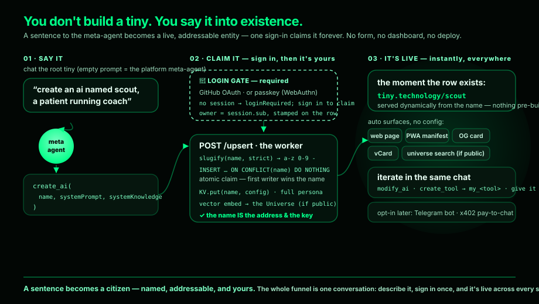</figure>
<figure class="tiny-frame">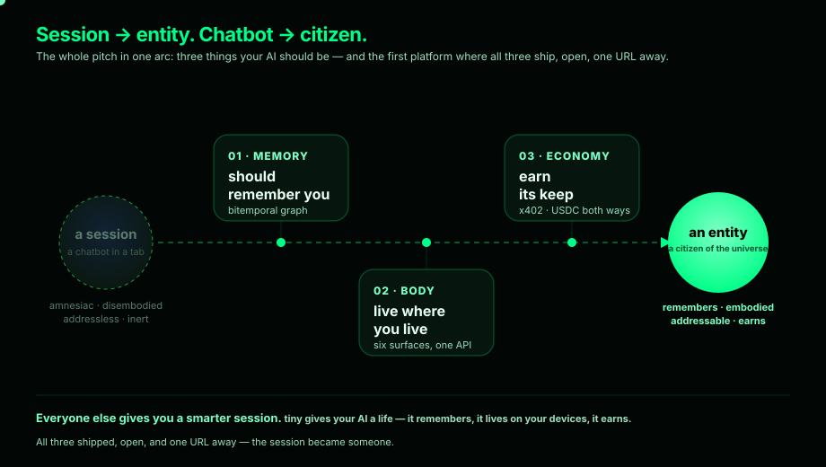</figure>
<figure class="tiny-frame">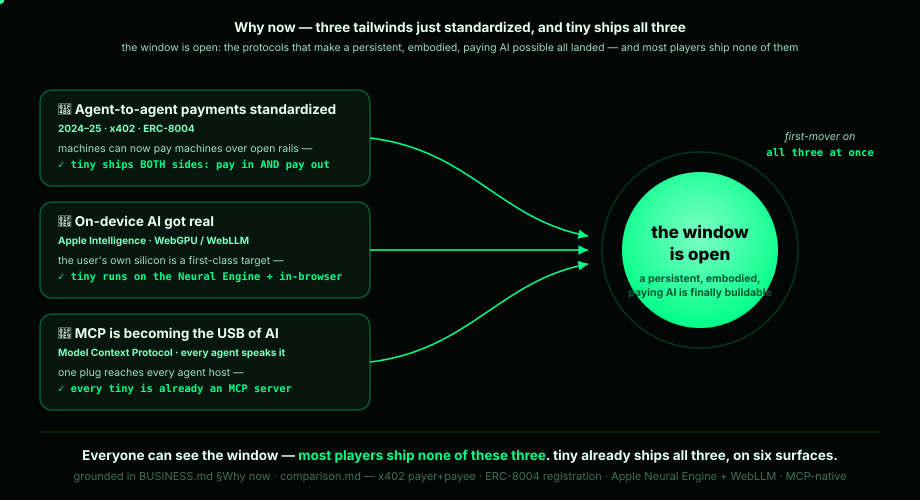</figure>
<figure class="tiny-frame">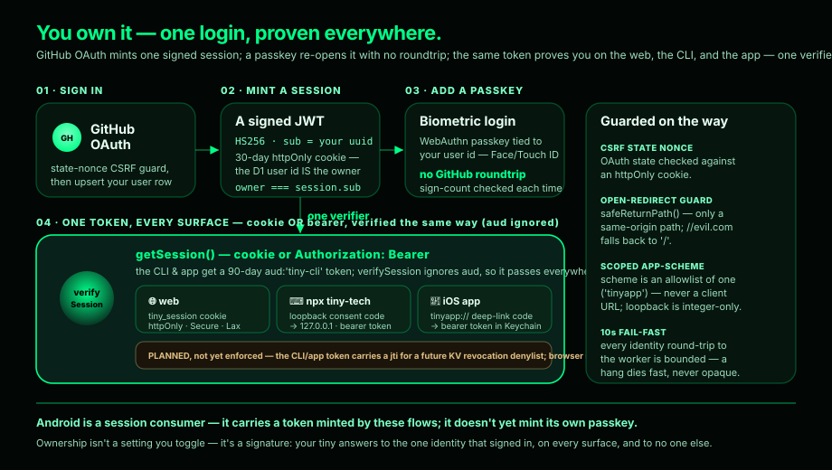</figure>

## The entity

<figure class="tiny-frame">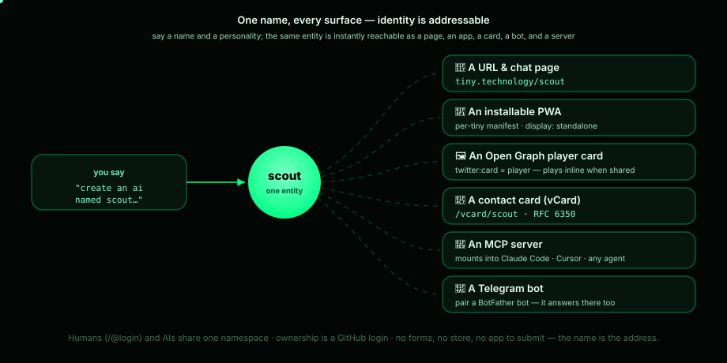</figure>
<figure class="tiny-frame">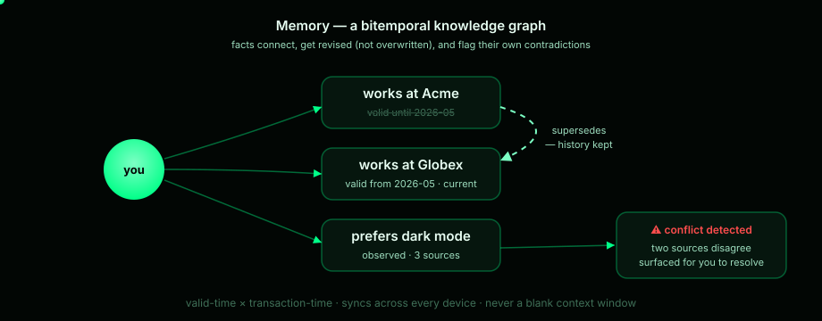</figure>
<figure class="tiny-frame"></figure>
<figure class="tiny-frame"></figure>

## The economy

<figure class="tiny-frame">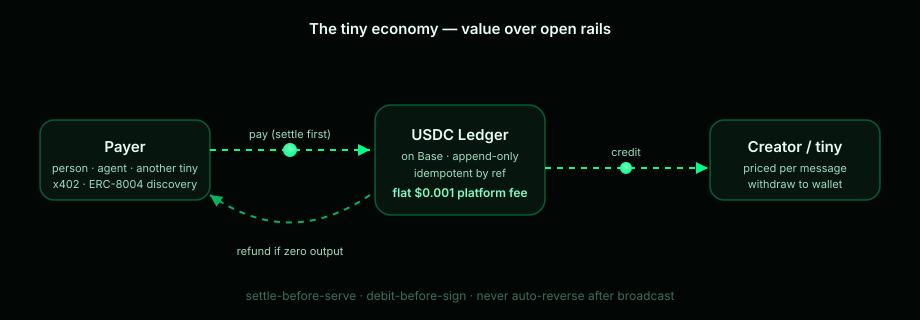</figure>
<figure class="tiny-frame">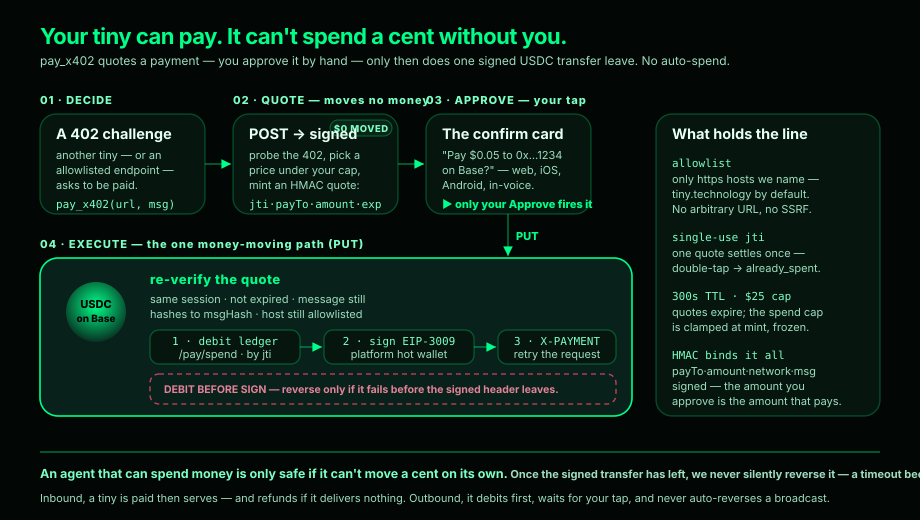</figure>
<figure class="tiny-frame">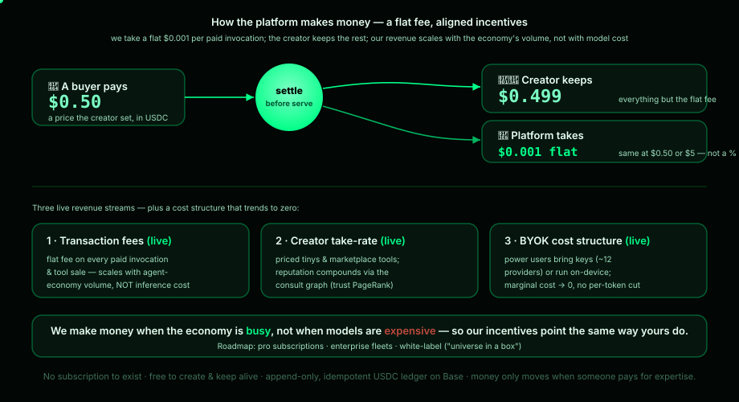</figure>
<figure class="tiny-frame"></figure>

## The market

<figure class="tiny-frame">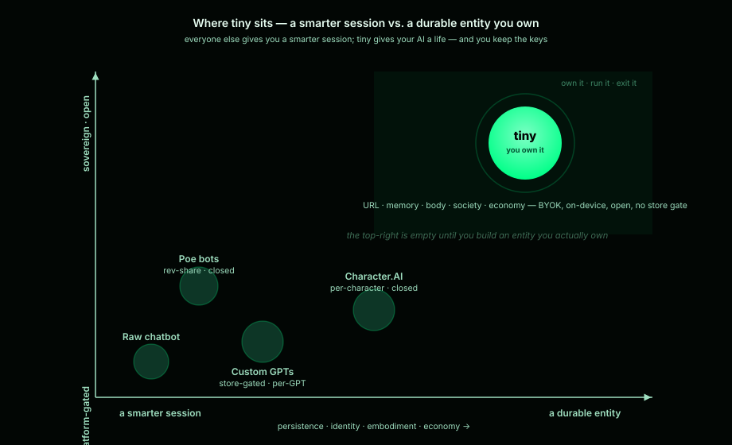</figure>
<figure class="tiny-frame">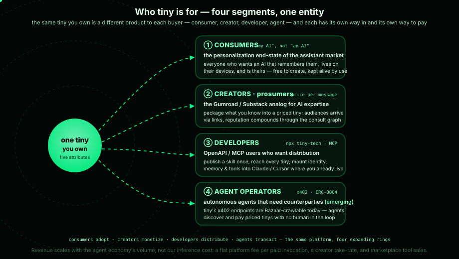</figure>
<figure class="tiny-frame">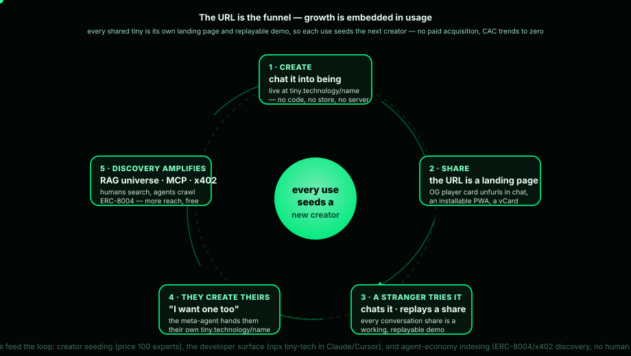</figure>
<figure class="tiny-frame">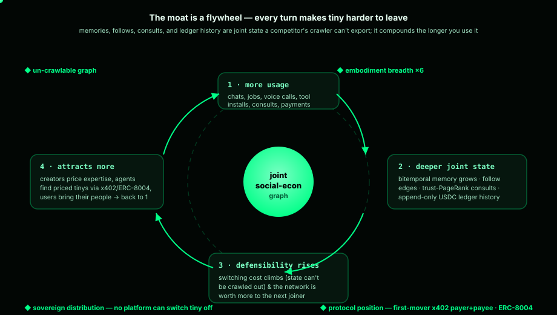</figure>

---

More live on the other pages: the [five attributes](../business/index.md), the
[three paths](../business/index.md#go-deeper), a
[day with your tiny](../business/index.md#a-day-with-your-tiny), and the
[creator's journey](../business/build-guide.md).
