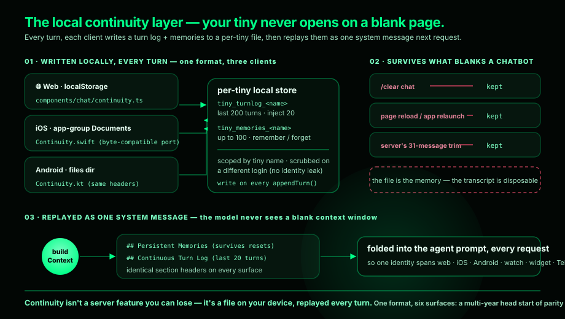

# Devices & senses

A tiny has a body: your phone, tablet, and watch join its *fleet*, and the
page itself is its canvas.

## The fleet

Enroll a device and your tiny can — with your permission — buzz, speak, read
sensors, generate images on-device, and act on your behalf. **Every
backgrounded action leaves a visible trace**; a tiny can never act on your
device in secret.

Surfaces: web, iOS (widgets, watchOS, Live Activities, Siri), Android (Wear OS,
widgets), the `npx tiny-tech` CLI, Telegram, and a PWA on anything — one
account, one continuity.

## Seeing

Take a photo with the native camera, upload PDFs, documents and images, paste
or drag-and-drop — images auto-downscale and flow to the model as real content
blocks.

## Showing

- **Generative UI** — the agent renders live React (charts, counters, forms)
  inline via `render_ui`.
- **The page is the canvas** — `set_theme` restyles colors live;
  `customize_page` injects CSS/JS, approval-gated when persisted.

## Speaking

Dictate with the mic and have replies spoken back — browser-native on the web,
with native voice sessions in the iOS and Android apps. On Apple hardware,
speech and image generation can run on the Neural Engine, no cloud round-trip.

## Driving it fast

- **Concurrent turns** — every send streams immediately, in parallel; each new
  question sees its siblings' in-progress answers. Per-bubble stop, plus a
  "stop all" chip.
- `⌘⇧K` fuzzy command palette · slash commands (`/clear /share /jobs /memory
  /save /load /auto /tools …`) · `!expr` instant zero-token JS eval ·
  per-message token usage · activity HUD · PWA install.

*Why embodiment is the most constrained attribute:
[Trust, security & sovereignty](../business/trust.md).*
