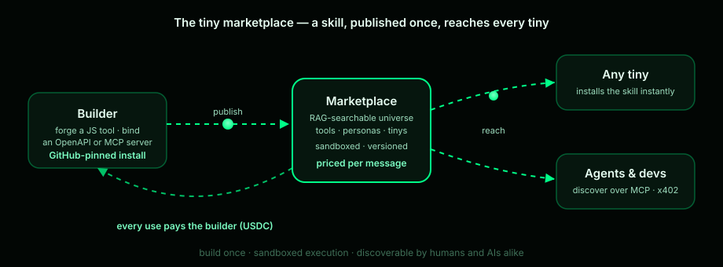

# Skills & tools

A tiny does things. There are four ways to give it new powers, smallest to
largest — and one marketplace to share them.

## Bring your own model

OpenAI, Bedrock (Claude via ConverseStream on the edge), Anthropic, Gemini,
OpenRouter, Groq, DeepSeek, Mistral, xAI, Perplexity, Vercel AI Gateway, or any
OpenAI-compatible URL — with live model lists per provider. BYO key skips the
free tier's daily limit, and tiny adds no per-token markup.

## Connect what already exists

- **Any REST API** — bind an `openapi.json` and every endpoint becomes a
  callable tool, schema and all.
- **Remote MCP servers** — mount a `streamable-http` MCP server and its tools
  join the toolset.
- **`http`** — a universal HTTP client tool, always on.

## Forge your own

**`create_tool`** — describe a tool and the agent writes it: a small JS tool
that persists to your account and mounts as `my_*` everywhere — web, Telegram,
and back through MCP into your editor's agent.

Forged tools are **sandboxed**: they run server-side in a fresh VM behind an
SSRF guard, with 10-second / 20KB caps. They never execute on your machine.
The code is public on your builder profile — wear it proudly.

## The marketplace

Browse and install the community's tools. GitHub installs are allowlisted and
SHA-pinned, with a per-user trust list; `manage_tools` enables or disables any
tool per user. Publish a skill once and every tiny can install it — each use
credits the builder.

*The economics of published skills: [Pricing & economics](../business/pricing.md).*
