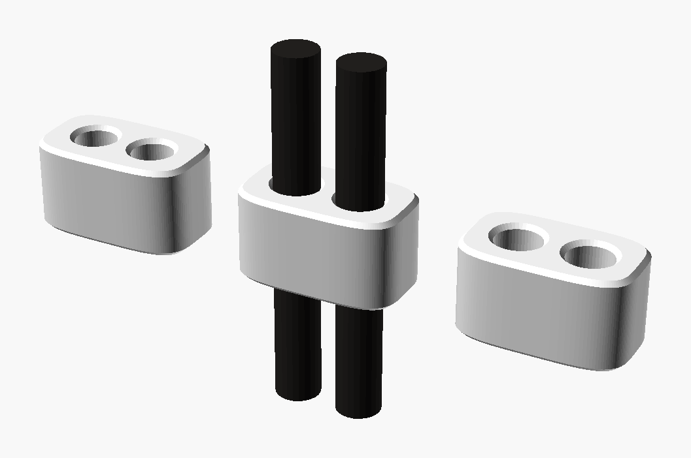

<h3 align="center"></h3>

<h1 align="center">the tiny necklace</h1>
<h4 align="center">Your tiny, worn. 💎</h4>

-----

A 3D-printed pendant around an [Arduino Nicla](https://store-usa.arduino.cc/products/nicla-vision) —
camera, mic, on-device ML — that joins your tiny's fleet like any phone. It sees,
it hears, it answers `photo` / `detect` / `faces` / `distance`, always with a
visible trace. Hangs on a 3mm cord closed by a printed bead: no clasp, no metal,
nothing bought but 60cm of cord.

**Three pendants, one file.** Everything is [`pendant.scad`](pendant.scad) —
`face="vision"`, `face="voice"`, or `bat=true` for the battery locket. The
plates below are that file, sliced and ready (0.12mm profile embedded — open,
`Slice plate`, `Print plate`):

| plate | for | weight | time |
|---|---|---|---|
| [`prints/vision.3mf`](prints/vision.3mf) | [Nicla Vision](https://store-usa.arduino.cc/products/nicla-vision) — eyes 📷 | 7.6 g | ~1 h |
| [`prints/voice.3mf`](prints/voice.3mf) | [Nicla Voice](https://store-usa.arduino.cc/products/nicla-voice) — ears 🎙️ | 6.3 g | ~48 m |
| [`prints/locket.3mf`](prints/locket.3mf) | Vision + 350mAh LiPo — untethered 🔋 | 14.7 g | ~1.5 h |
| [`prints/cordkit.3mf`](prints/cordkit.3mf) | 3 beads, 3 grips — keep the one that feels right | 1 g | 15 m |

The cord wraps once over the crown, drops into a groove that <i>locates but never
captures</i>, and the bead closes the loop. Slide it — that's the whole clasp.

**Then:** buy 60cm of 3mm cord (waxed cotton or leather), pop the board in,
pair from the tiny app (Nearby → 💎 Set up), wear your tiny.

**The receipts** 🧾 — every dimension here was measured off the vendor STEP with
a digital caliper script, and every print was gated by scripts that read the
*sliced toolpath*, not the mesh — because "the model has a hole" is not "the
print has a hole". Numbers, gates, and the slicer lessons that cost the most
time: [**PRINTS.md**](PRINTS.md).

**Firmware** lives in [cagataycali/strands-nicla](https://github.com/cagataycali/strands-nicla) —
WiFi/BLE provisioning, the fleet heartbeat, and the on-device models
(~48ms/inference from QSPI). This folder is the body; that repo is the nervous system.

| | |
|---|---|
| board | [Nicla Vision](https://store-usa.arduino.cc/products/nicla-vision) $115 · [Nicla Voice](https://store-usa.arduino.cc/products/nicla-voice) $85 |
| plastic | ~8–15 g PLA, two colors |
| cord | 60 cm × 3 mm, ~$1 |
| battery (locket) | 402535 LiPo 350 mAh, ~$6 |

<h5 align="center">printed with 💚, worn with 😎</h5>
