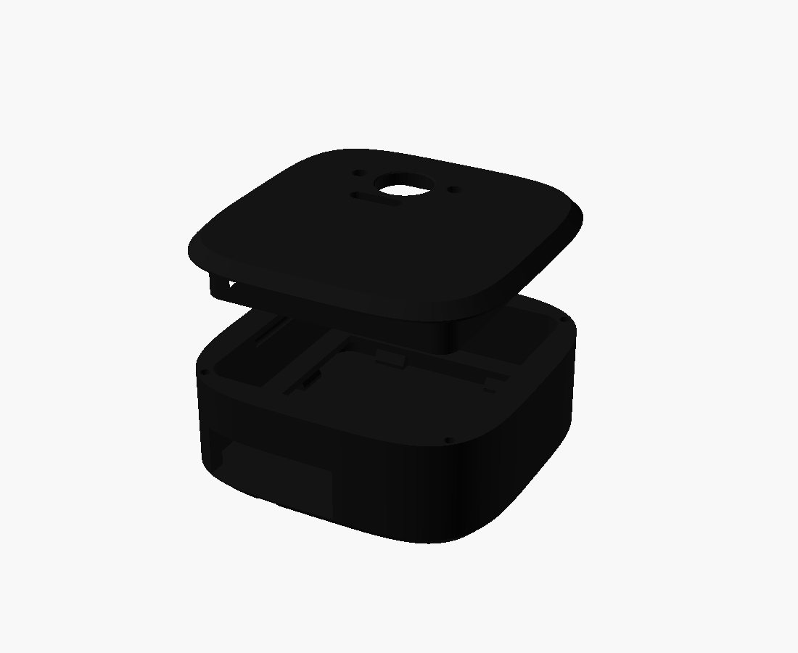
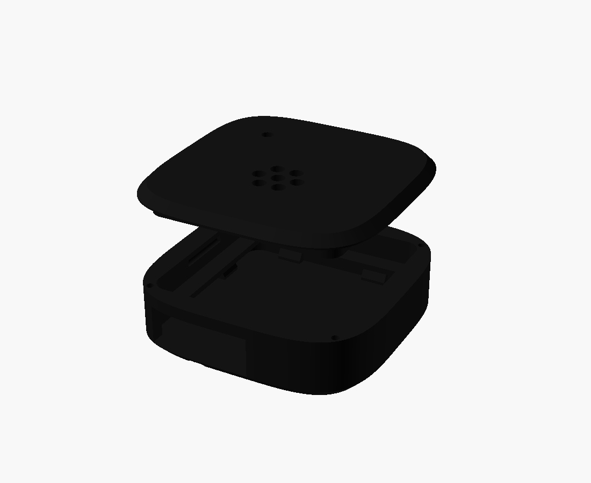
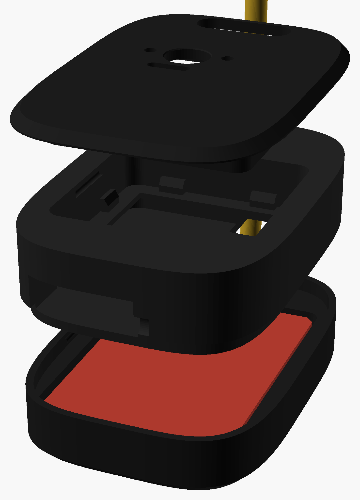
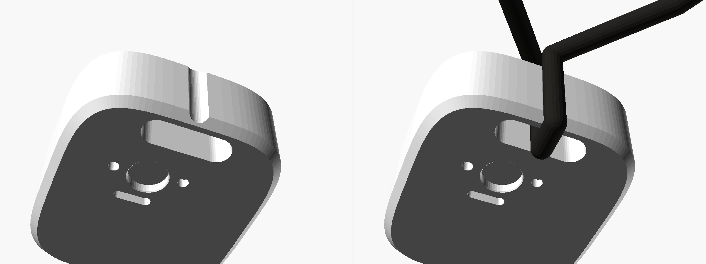

# The tiny necklace

### Your tiny, worn. A 3D-printed pendant around an Arduino Nicla — camera, mic, on-device ML — that enrolls as a fleet node like any phone.

---

## What this is

A **wearable body for your tiny**, built on the
[Arduino Nicla](https://store-usa.arduino.cc/products/nicla-vision) family:

| Pendant | Board | It gives your tiny | Case |
|---|---|---|---|
| **tiny vision** | [Nicla Vision](https://store-usa.arduino.cc/products/nicla-vision) — STM32H747, 2MP cam, mic, ToF, IMU, WiFi/BLE | Eyes: photos, person detection, face FOMO, distance, sentry watch — vision models run **on-device from QSPI romfs at ~48ms/inference** | `cad/tiny_v29_vision_x1.3mf` — 7.63 g, ~1 h print |
| **tiny voice** | [Nicla Voice](https://store-usa.arduino.cc/products/nicla-voice) — nRF52832 + NDP120, always-listening mic | Ears: wake-word spotting on the NDP120 at microwatts; a phone acts as its BLE gateway | `cad/tiny_v29_voice_x1.3mf` — 6.26 g, ~48 min |
| **tiny locket** | Nicla Vision + 402535 LiPo (350 mAh) | Untethered: the battery pendant, snap-on cell cover | `cad/tiny_v29_locket.3mf` — 14.67 g, ~1.5 h |

The pendant hangs on a **3 mm cord closed by a printed bead** — no clasp, no metal,
nothing bought but 60 cm of cord. Print it on any FDM printer (plates are sliced
for a Bambu Lab X2D at 0.12 mm; the parametric source reslices for anything).

Once worn, the necklace is a **device node** in your tiny's fleet: it heartbeats,
polls the relay mailbox, and answers the same `nicla_*` tools your phone answers —
photos, person/face detection, distance, IMU, spoken memos — always with a
visible trace, like every other body your tiny has.

<b>vision</b> · <b>voice</b> · <b>locket</b> — one parametric case (<code>cad/tiny_necklace_split.scad</code>), three faces

## Print it

Open a plate in Bambu Studio (or any 3MF-aware slicer), `Slice plate`, `Print plate`.
The 0.12 mm jewelry profile travels **inside** each 3MF, so opening the file already
selects it.

| file | what | weight | time |
|---|---|---|---|
| [`cad/tiny_v29_vision_x1.3mf`](cad/tiny_v29_vision_x1.3mf) | 1 Vision pendant: tray + white seven-ring mark + door, two-color | 7.63 g | 59 m 54 s |
| [`cad/tiny_v29_vision_x2.3mf`](cad/tiny_v29_vision_x2.3mf) | the same plate ×2 | 14.91 g | 1 h 57 m |
| [`cad/tiny_v29_voice_x1.3mf`](cad/tiny_v29_voice_x1.3mf) | 1 Voice pendant (`face="voice"`, 9.5 mm deep) | 6.26 g | 48 m 20 s |
| [`cad/tiny_v29_locket.3mf`](cad/tiny_v29_locket.3mf) | battery locket: tray + mark + snap-on cell cover + door | 14.67 g | 1 h 36 m |
| [`cad/tiny_v29_cordkit.3mf`](cad/tiny_v29_cordkit.3mf) | 3 sliding beads at 2.8/2.9/3.0 mm bore — keep the one that grips right | 1.03 g | 15 m |

Then **buy 60 cm of 3 mm cord** (waxed cotton or leather). That number is measured,
not chosen: the hero render's loop is two cubic Béziers whose arc length is gated by
`check_fit.py hero` — 44.3 cm worn, and a clasp-free necklace's longest setting must
clear a head. Wrap the cord once around the crown bar (in through the window, over
the crown seat, back down), thread both tails through the bead. Slide the bead: that
is the whole adjustment mechanism.

## The engineering

Everything here was **measured, not guessed** — and the file that carries the
receipts is [`PRINTS.md`](PRINTS.md):

- **Board truth from the STEP, to a hundredth of a millimetre.** Camera lens
  center, off-center USB shell, the ToF window the lid needs, the 2.97 mm
  LED/reset collision on the Voice that a normal glow window would have punched
  through. Both boards are 22.86 × 22.86 × 0.95 — so tray, snap and cord system
  are shared verbatim; only the lid features and depth differ.
- **The toolpath is the unit under test.** Four gates read the *sliced gcode*,
  not the mesh, because "the model has a hole" is not "the print has a hole":
  `check_fit.py` (geometry + interference), `check_slice.py` (per-extruder flush
  matrix, first-layer color), `check_seat.py` (the cord groove, layer by layer,
  including whether a 3 mm cord physically reaches its bottom), `check_kit.py`
  (every bead bore open and walled on every layer). Each was confirmed to FAIL
  on a negative control before being trusted.
- **The cord replaced a chain that could not attach.** The earlier print-in-place
  chain's 7.6 mm links had to clear the bar's 12.59 mm diagonal — 22 mm³ of solid
  interference the renders had been hiding for two versions. `check_fit.py` now
  measures that instead of asserting it.
- **The seat locates, it does not capture.** The crown groove's mouth is 0.12 mm
  narrower than the cord, its arc center 0.7 mm *outside* the crown — widest at
  the mouth, no undercut, the cord drops in and lifts straight out. The bead
  closes the loop. Cut along Z so it adds zero overhang and zero support.
- **The back wears the mark**: the seven-ring tiny logo as a two-color inlay,
  its pocket and insert depths locked to a shared layer-boundary constant and
  gated by `check_fit.py --deboss`.

## Firmware & software

The necklace's MicroPython firmware and the `strands-nicla` Python package
(USB REPL control, DFU flashing, provisioning) live in
[**cagataycali/strands-nicla**](https://github.com/cagataycali/strands-nicla):

- **First-boot provisioning** — WiFi-AP portal *and* BLE GATT, pairing with the
  tiny iOS/Android apps' Nearby → 💎 "Set up" flow
- **Device-node loop** — heartbeat (with its own LAN address, so the live view
  dials the board directly at ~16 fps on shared WiFi) + relay poll + commands:
  `photo`, `detect`, `faces`, `distance`, `imu`, `listen`, `sentry`
- **On-device ML** — person_detect, FOMO face detection, micro_speech keyword
  spotting, XIP from QSPI romfs

The platform side — the `nicla_*` and `nicla_voice_*` tools the agent calls, the
relay mailbox, transcripts, the phones' live view — is this repo:
[`web/lib/chat/tools/nicla.ts`](../web/lib/chat/tools/nicla.ts) ·
[`worker/src/relay.ts`](../worker/src/relay.ts) ·
[`worker/src/devices.ts`](../worker/src/devices.ts).

## Directory

| path | what |
|---|---|
| [`PRINTS.md`](PRINTS.md) | Print quick-reference + every measured number and slicer lesson |
| [`cad/*.3mf`](cad/) | Sliced plates (profile embedded) — open, slice, print |
| [`cad/v29_*.stl`](cad/) | Raw v2.9 meshes for other slicers |
| [`cad/tiny_necklace_split.scad`](cad/tiny_necklace_split.scad) | The parametric case — one file, three pendants (`face=`, `bat=`) |
| [`cad/tiny_full_necklace.scad`](cad/tiny_full_necklace.scad) | The whole necklace as one model (hero renders, cord-length math) |
| [`cad/check_*.py`](cad/) | The toolpath gates |
| [`cad/make_profile.py`](cad/make_profile.py) · [`patch_project.py`](cad/patch_project.py) | The 0.12 mm jewelry profile + embedding it into the 3MFs |
| [`cad/profiles/`](cad/profiles/) | Print profiles (Bambu X2D) |
| [`cad/renders/`](cad/renders/) | Renders composed from the baked STLs |

## Bill of materials

| item | qty | ~cost |
|---|---|---|
| [Arduino Nicla Vision](https://store-usa.arduino.cc/products/nicla-vision) *or* [Nicla Voice](https://store-usa.arduino.cc/products/nicla-voice) | 1 | $115 / $85 |
| PLA, two colors | ~8–15 g | pennies |
| 3 mm cord (waxed cotton or leather) | 60 cm | ~$1 |
| 402535 LiPo 350 mAh (locket only) | 1 | ~$6 |

Print the case, provision the board from the phone app, wear your tiny.
